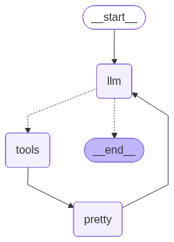
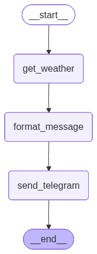
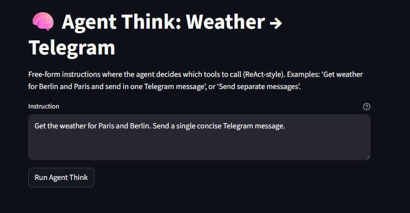
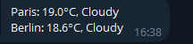

[](https://mseep.ai/app/noureldin-ali-mcp-langgraph-weather-telegram)

# 🌤️ MCP + LangGraph: Weather → Telegram (Streamlit)

Personal project that wires two MCP servers (Weather and Telegram) to LangGraph agents and simple Streamlit UIs. It fetches current weather and sends a concise summary to your Telegram chat. Includes both a fixed “Flow Agent” and a tool‑using “Agent Think” mode.

<p align="center">
  <a href="https://www.python.org/"></a>
  <a href="https://streamlit.io/"></a>
  <a href="https://langchain.com/"></a>
  <a href="https://langchain-ai.github.io/langgraph/"></a>
  <a href="https://modelcontextprotocol.io/"></a>
  <a href="https://www.docker.com/"></a>
  <a href="https://core.telegram.org/bots"></a>
  <br/>
  <em>Tech stack at a glance</em>
  
</p>

## ✨ Highlights
- 🛰️ MCP servers over stdio:
  - ⛅ Weather: Open‑Meteo geocoding + current weather (no API key)
  - ✈️ Telegram: Bot API `sendMessage`
- 🤖 Two agents and UIs:
  - 🔁 Flow Agent: deterministic 3‑step graph (weather → format → send)
  - 🧠 Agent Think: tool‑using ReAct‑style loop (multi‑city, combined or separate messages)
- 🧩 Streamlit frontends; 🐳 Dockerfile + docker‑compose for one‑command run
- 🔌 Pluggable LLMs via `LLMConnector`: OpenAI, Groq, Azure OpenAI

## 🔁 Flow Agent vs 🧠 Agent Think
- 🎯 Purpose: Flow Agent runs a fixed pipeline; Agent Think plans tool calls.
- ⌨️ Input style:
  - 🔁 Flow Agent: one location input; always formats and sends one message.
  - 🧠 Agent Think: free‑form instruction; can handle multiple cities, combine results, or send separate messages.
- 🧭 Control: Flow is simple and predictable. Agent Think decides when to call tools, how many times, and what to send.
- ✅ When to use:
  - Use 🔁 Flow for fast single‑city updates to Telegram.
  - Use 🧠 Think for multi‑city tasks or custom sending behavior.

### 🧠 Agent Think graph (example)



## 🚀 Quick Start (Local)
1) Create a virtualenv and install dependencies
```
python -m venv .venv
. .venv/Scripts/activate  # Windows
# source .venv/bin/activate  # macOS/Linux
pip install -r requirements.txt
```
2) Create and fill `.env` with your LLM provider key(s) and Telegram bot info. See “Environment” below. Do NOT commit real secrets to Git.

3) Run a Streamlit UI
```
# 🔁 Flow Agent (single city → one message)
streamlit run streamlit_app.py

# 🧠 Agent Think (free‑form, multi‑city, combined/separate)
streamlit run streamlit_think_app.py
```
Open the printed URL and follow the prompts. By default (Docker compose): Flow → http://localhost:8501 and Think → http://localhost:8502.

## 🐳 Docker
Multi‑stage Dockerfile exposes two targets and docker‑compose wires both:
```
docker compose up --build
# Flow UI → http://localhost:8501
# Think UI → http://localhost:8502
```
Build images separately (optional):
```
docker build -t mcp-weather-telegram:flow  --target flow  .
docker build -t mcp-weather-telegram:think --target think .
```

## 🔑 Environment
Set these in `.env` (example placeholders shown — keep real values private):
- LLM selection:
  - `LLM_TYPE` = `openai` | `groq` | `azure_openai`
  - `LLM_MODEL_NAME` (e.g., `gpt-4o-mini`, `gpt-4.1-mini`, `llama-3.1-70b-versatile`)
  - `LLM_TEMPERATURE` (default 0.2)
  - `LLM_MAX_RETRIES` (default 2)
- Provider keys:
  - `OPENAI_API_KEY` or `GROQ_API_KEY`
  - For Azure OpenAI: `AZURE_OPENAI_API_KEY`, `AZURE_OPENAI_ENDPOINT`
- Telegram (for the Telegram MCP server):
  - `TELEGRAM_BOT_TOKEN`
  - `TELEGRAM_CHAT_ID` (user/group/channel)
- Weather default units:
  - `DEFAULT_WEATHER_UNITS` = `metric` | `imperial`

Tip: Commit an `.env.example` with placeholders, but never commit your real `.env`.

## ⚙️ How It Works
- MCP servers (stdio) are defined in `mcp_client/servers_config.json` and launched automatically:
  - `weather` → `mcp_servers/weather_server/server.py`
  - `telegram` → `mcp_servers/telegram_server/server.py`
- Flow Agent graph (`agent/graph.py`):
  - `get_weather` → `format_message` (via LLM) → `send_telegram`
- Agent Think (`agent_think/app.py`):
  - LLM is bound to tools (`get_weather`, `send_telegram`) and plans calls in a short loop.
  - Supports multiple cities and either one combined Telegram message or one‑per‑city.

### 📸 Optional Flow graph image



## 🧪 Examples

### 🔁 Flow Agent
- Input: enter a single location (e.g., “Paris, FR”) and click Run.
- Output (Telegram message example):

```
• Paris, FR — 18°C, feels 17°C
• Humidity 62% · Wind 8 km/h
```
Notes: Actual values depend on current weather and selected units.

### 🧠 Agent Think (combined)
- Instruction:

```
Get the weather for Paris and Berlin. Send a single concise Telegram message.
```
- Output (Telegram message example):
```
• Paris, FR: 18°C, clear · Wind 10 km/h
• Berlin, DE: 16°C, cloudy · Wind 12 km/h
```

### 🧠 Agent Think (separate)
- Instruction:
```
Get weather for Madrid and Barcelona and send separate Telegram messages for each.
```
- Output: two messages (one per city), for example:
```
• Madrid, ES: 24°C, sunny · Wind 9 km/h
• Barcelona, ES: 22°C, breezy · Wind 14 km/h
```
Notes: When unspecified, Agent Think defaults to a single combined message.

### 🖼️ Screenshots
- Agent UI



- Agent Results



## 📁 Repository Layout (partial)
```
Dockerfile
docker-compose.yml
requirements.txt
streamlit_app.py                # Flow Agent UI
streamlit_think_app.py          # Agent Think UI
agent/                          # Flow Agent graph + nodes + state
agent_think/                    # Agent Think graph (tools + loop)
mcp_client/servers_config.json  # Where MCP servers are defined
mcp_servers/weather_server/     # Weather MCP server (Open‑Meteo)
mcp_servers/telegram_server/    # Telegram MCP server (Bot API)
test/                           # Notebooks used during development
assets/                         # README images
```

## 📝 Notes
- Your Telegram bot must have an open conversation with your account/group.
- `TELEGRAM_CHAT_ID` can be a user ID, group ID, or channel ID.
- No weather API key is required (Open‑Meteo).
- In production, store secrets in a proper secret manager.

## ⚠️ Disclaimer
This is a personal project for learning and demonstration purposes. It is not an official product and has no affiliation with OpenAI, Telegram, Open‑Meteo, LangChain, or Streamlit. Use at your own risk and review the code and configuration before deploying anywhere sensitive.
## Telegram Listener Loop
If you want the agent to react to incoming Telegram chats without Streamlit, run the polling loop:

```
python -m agent_think.runner --timeout 20
```

The listener uses the same MCP servers configuration (`mcp_client/servers_config.json`). Ensure the following environment variables are set before starting it:
- `TELEGRAM_BOT_TOKEN`: Bot token used by the Telegram MCP server.
- `TELEGRAM_CHAT_ID`: Default chat for outbound messages (still required; per-message chats are derived from updates).
- LLM provider variables (`LLM_TYPE`, credentials) so the agent can plan tool calls.

The script keeps the latest `update_id` in memory while it is running; restart from scratch replays any unseen updates. Pass `--idle-sleep` to control how long the loop waits between empty polls, and adjust `--timeout` to tune long polling.
